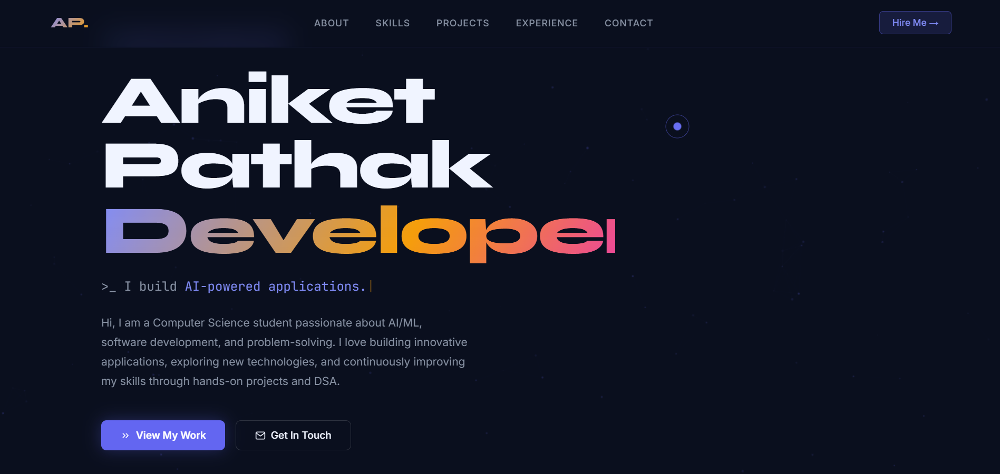
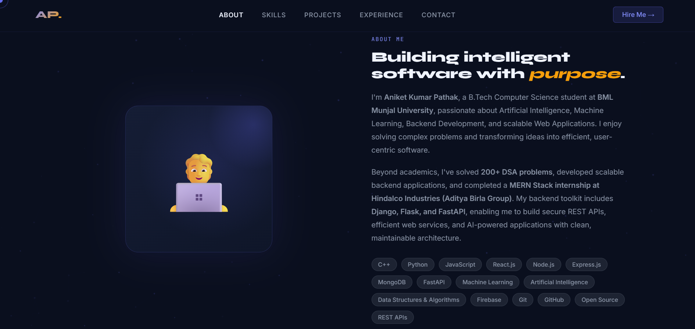

# 🚀 Developer Portfolio

A modern, responsive personal portfolio website showcasing my projects, technical skills, and journey as a **Software Engineer** and **AI/ML Enthusiast**.




## 👨‍💻 About Me

Hi, I'm **Aniket Kumar Pathak**, a B.Tech Computer Science student passionate about building scalable software and intelligent applications.

My interests include:

* 🤖 Artificial Intelligence & Machine Learning
* ⚡ Backend Development (FastAPI, Django, Flask)
* 🌐 Full-Stack Web Development
* 💻 Competitive Programming & Data Structures
* 🚀 Software Engineering

---

## ✨ Features

* 🎨 Modern Responsive UI
* 🌙 Dark Theme
* ⚡ Smooth Animations
* 📱 Mobile-Friendly Design
* 💼 Projects Showcase
* 🛠 Technical Skills Section
* 📄 Resume Download
* 📬 Contact Section
* 🔗 GitHub & LinkedIn Integration

---

## 🛠 Tech Stack

### Frontend

* HTML5
* CSS3
* JavaScript (ES6)

### Backend

* FastAPI
* Django
* Flask

### Programming Languages

* C++
* Python
* JavaScript

### Tools & Technologies

* Git
* GitHub
* Firebase
* REST APIs
* VS Code

---

## 📌 Featured Projects

* 🤖 AI & Machine Learning Projects
* 🌐 Full-Stack Web Applications
* ⚡ Selenium Automation Suite
* 📱 Backend API Development

---

## 📊 Highlights

* ✅ 200+ DSA Problems Solved
* 💼 MERN Stack Internship at Hindalco Industries (Aditya Birla Group)
* 🚀 Passionate about AI, Backend Development & Software Engineering

---
---

## 🚀 Getting Started

Clone the repository

```bash
git clone https://github.com/itsaniket2007/developer-portfolio.git
```

Open the project

```bash
cd developer-portfolio
```

Run locally by opening `index.html` in your browser.

---

## 📬 Connect With Me

* 📧 Email: **[itsaniket2007@gmail.com](mailto:itsaniket2007@gmail.com)**
* 💼 LinkedIn: https://www.linkedin.com/in/aniket-kumar-pathak/
* 🐙 GitHub: https://github.com/itsaniket2007

---

## ⭐ Support

If you like this project, consider giving it a ⭐ on GitHub. It motivates me to build more amazing projects!

---

